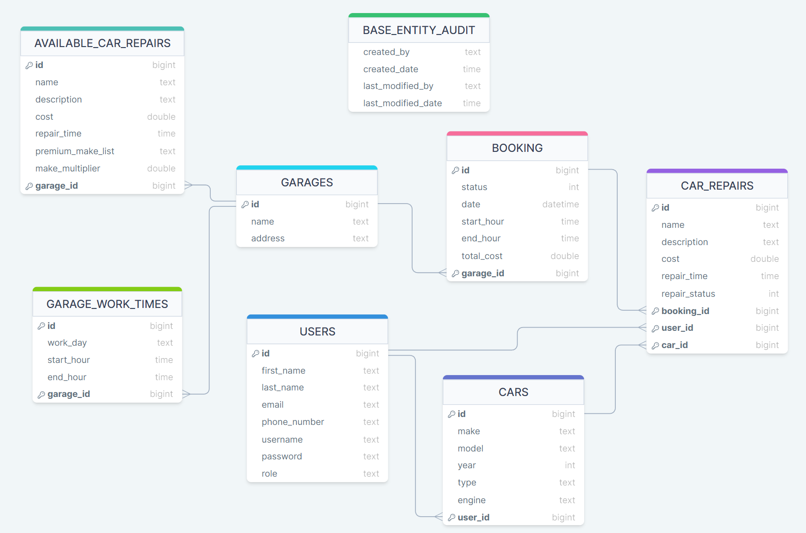
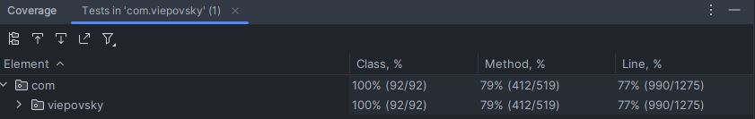

# CAR SERVICE GARAGE

Car Service Garage is an intuitive **RESTful** application that allows users to book appointments for car repairs or services at various automotive workshops located in different cities. Users can easily select the workshop of their choice and the specific service they want to have performed on their car.
The application offers a convenient way to browse the history of reserved services and make changes to existing reservations.
The backend version of the application provides all necessary components, including classes for data storage, services, and endpoints.

## This is backend repository, link to frontend

This repository contains the backend of Car Service Garage.
It can run as a standalone version, which can be tested with Postman. However, it is designed to run with the frontend version, which can be found here: [**GitHub**](https://github.com/viepovsky/Car-Service-Garage-Frontend).

## Technologies

The backend uses popular frameworks, technologies such as:

- Spring Boot: Data JPA, Validation, Web, MVC
- Application secured using Spring Security with JWT 
- Hibernate
- Unit tests with: JUnit, Mockito
- Lombok
- PostgreSQL main database
- H2 database for tests
- Gradle
- Docker
- Swagger

Please note that the application's frontend was developed with **Vaadin** and designed just only to show capabilities of the backend. As a result, the visual design may not be as good as other parts of the application.

## Usage of external API

At the moment, the application is using two external API:

- Car API to provide car details such as the year, make, model, and type.
- Weather API to retrieve a 13-day forecast for the garage location.

Car API is used to retrieve car details when user adds or edits their car. The weather API is used during booking, to show the weather near selected workshop on the selected date. Additionally, a **scheduler** has been implemented to daily retrieve data from the Car and Weather API.
This data is then stored in a database, allowing the frontend application to quickly access the information directly from the backend, rather than sending requests to external APIs with every page reload.

## How to run
### Using Docker
If Docker is installed and running you can simply run the entire application by executing `docker compose up -d` in the terminal.
Wait for containers to start then open `http://localhost:8081` to test the application.

### Without Docker
If Docker is not installed, follow the instructions below:

- First run the backend by running `AppBackendApplication` class or simply type `./gradlew bootRun` in terminal.
- To start the frontend, run `Application` class or simply type `./mvnw spring-boot:run` in terminal.
- Wait for the applications to start then open `http://localhost:8081` to test the application.

If you encounter permission issues on Mac/Linux with the error message `zsh: permission denied: ./mvnw`, simply type `chmod +x ./mvnw` in terminal to make the `mvnw` file executable. Then type `./mvnw spring-boot:run` again to start the application.

## Logging to site, initial data

The backend of Car Service Garage contains initial data to demonstrate the application's capabilities. After testing with the provided user account, you can add your own to test the application with your own data. Please note that the data is being reset after each backend application run.

To log in as provided user, use the username: `testuser` and the password: `testpassword`

## Future plans for the application

Next, I will develop an ADMIN view for the application, which will allow administrators to add new garage locations and update the current status of customer cars during repairs and services.
In addition, the view will enable administrators to manage customer accounts and their associated cars, allowing them to make changes at the customer's request.

~~Additionally, I will implement endpoint security, as currently only the frontend is secured.~~ ✅ Done.

## Database schema and test coverage:

